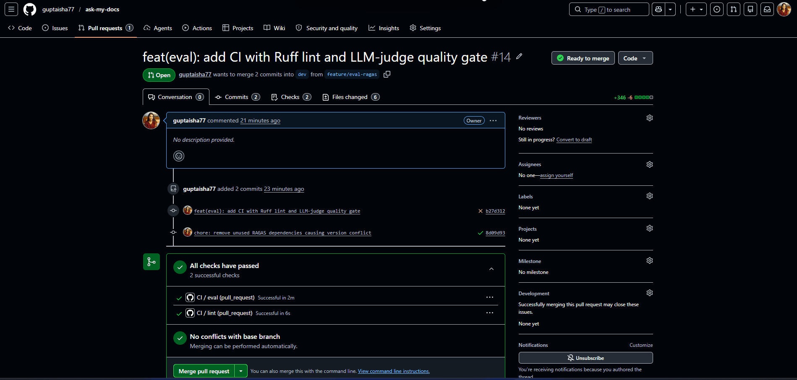
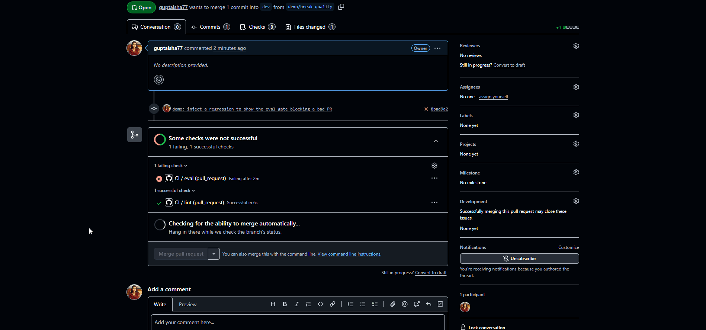
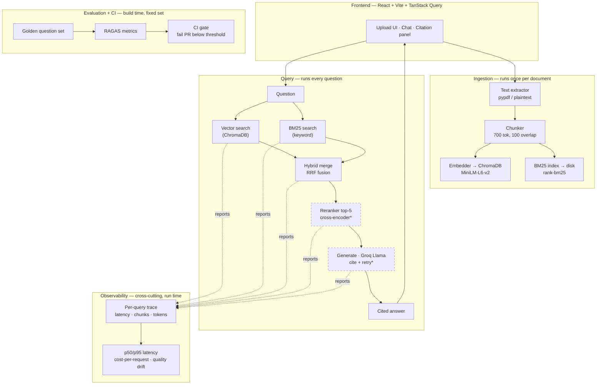

# Ask My Docs

A domain-specific question-answering system over your own documents, built with
**hybrid retrieval** (keyword + semantic search), **cross-encoder reranking**,
**enforced citations**, and a **CI-gated evaluation pipeline**.

Upload a set of documents, ask questions in natural language, and get answers
that cite the exact source passages they came from — with answer quality
measured automatically on every change.

> **Status:** Active development. This README documents the full target
> architecture; see the [build status](#build-status) table for what is live today.

---


## Demo: the eval gate in action

Every pull request runs an automated LLM-judge evaluation that scores answer
quality (faithfulness and relevancy) against a fixed golden set. The build
**passes only if quality stays above threshold** — so a change that regresses
answer quality fails CI and blocks the merge.

**A passing PR** — answer quality is above threshold, so CI is green and the
change can merge:



**A regressing PR** — a change that degrades answer quality drops the scores
below threshold, so the eval check fails and the merge is blocked:




## Why this project exists

Most retrieval-augmented generation (RAG) demos stop at "embed documents, do a
vector search, ask an LLM." That falls apart in practice: vector search misses
exact terms (product codes, clause numbers), answers can't be trusted without
sources, and there's no way to know if a change made quality better or worse.

This project addresses all three:

- **Hybrid retrieval** combines BM25 keyword search (catches exact terms) with
  vector search (catches meaning), so neither blind spot sinks an answer.
- **Cross-encoder reranking** re-scores candidates with a model that reads the
  question and passage *together*, lifting the genuinely relevant chunks to the top.
- **Citation enforcement** validates that every answer points back to retrieved
  source passages, so responses are auditable rather than trusted blindly.
- **CI-gated evaluation** runs an LLM-as-judge evaluation on every pull request
  and blocks merges that regress answer quality below set thresholds.
- **Monitoring & observability** (planned) wraps every query stage as a
  cross-cutting layer — tracing, latency percentiles (p50/p95), and
  cost-per-request — because operating a RAG system is most of the real work, and
  the code is built with the seams to support it from the start.

---

## Architecture



> The dashed stages (reranker, citation-retry) are designed but not yet built —
> see the [build status](#build-status) below. Observability is drawn as a
> cross-cutting layer because every query stage reports into it, rather than being
> a final step; eval + CI is separate because it runs at build time on a fixed
> set, not on live traffic.

---

## Tech stack

| Layer | Technology | Why |
|---|---|---|
| Frontend | React, Vite, Bun, TanStack Query, Biome | Fast tooling, production data-fetching, single lint+format tool |
| Backend | Python, FastAPI | Type-validated API with auto-generated docs |
| Vector store | ChromaDB | Local, zero-infra vector database |
| Embeddings | sentence-transformers (MiniLM-L6-v2) | Runs locally, no API cost |
| Keyword search | rank-bm25 | Exact-term matching to complement vectors |
| Fusion | Reciprocal Rank Fusion | Combines rankings without reconciling score scales |
| Reranking | Cohere Rerank | Cross-encoder relevance scoring |
| LLM / generation | Groq (Llama 3.1) | Fast, low-cost inference via an OpenAI-compatible API |
| Orchestration | LangChain, LangGraph | Explicit, branchable agent graph |
| Evaluation | LLM-as-judge (Groq) | Faithfulness + relevancy, gated in CI |
| CI | GitHub Actions | Automated eval gate on every PR |

---

## Build status

| Component | Status |
|---|---|
| Project scaffold + config | ✅ Done |
| Document ingestion — token-aware chunker | ✅ Done |
| Embedding + ChromaDB storage | ✅ Done |
| BM25 keyword index | ✅ Done |
| Hybrid retrieval (RRF fusion) | ✅ Done |
| Grounded cited generation (Groq) | ✅ Done |
| Text extractor (PDF / plaintext) | ✅ Done |
| Ingestion pipeline (extract → chunk → dual store) | ✅ Done |
| LLM-judge evaluation + CI gate (Ruff lint + quality gate) | ✅ Done |
| Cohere reranking | ⬜ Planned |
| LangGraph agent + citation enforcement | ⬜ Planned |
| React frontend | ⬜ Planned |
| Monitoring & observability (tracing, p50/p95 latency, cost-per-request) | ⬜ Planned |

---

## Getting started

### Prerequisites

- Python 3.11+
- [Bun](https://bun.sh) (for the frontend)
- A Groq API key (from [console.groq.com](https://console.groq.com)); a Cohere API key is optional (reranking is a planned phase)

### Backend setup

```bash
cd backend

# Create and activate a virtual environment
python -m venv .venv
source .venv/bin/activate        # Windows: .venv\Scripts\activate

# Install dependencies
pip install -r requirements.txt

# Configure secrets
cp .env.example .env             # then edit .env with your real keys

# Run the API
uvicorn app.main:app --reload --port 8000
```

The interactive API docs are then available at `http://localhost:8000/docs`.

### Frontend setup

```bash
cd frontend
bun install
bun run dev
```

---

## Configuration

All settings live in `backend/app/core/config.py` and are loaded from environment
variables or a `.env` file. Key tunables:

| Setting | Default | Description |
|---|---|---|
| `GROQ_API_KEY` | (none) | Your Groq API key — required to generate answers |
| `GROQ_MODEL` | `llama-3.1-8b-instant` | Groq model used for generation |
| `CHUNK_SIZE` | 700 | Target chunk size in tokens |
| `CHUNK_OVERLAP` | 100 | Token overlap between adjacent chunks |
| `BM25_TOP_K` | 10 | Keyword candidates retrieved |
| `VECTOR_TOP_K` | 10 | Semantic candidates retrieved |
| `RERANK_TOP_K` | 5 | Chunks kept after reranking |

Invalid configurations (e.g. `CHUNK_OVERLAP` larger than `CHUNK_SIZE`) are
rejected at startup rather than failing later at runtime.

---

## Project structure

```
ask-my-docs/
├── backend/
│   ├── app/
│   │   ├── api/          # FastAPI route handlers
│   │   ├── core/         # Config and settings
│   │   ├── ingestion/    # Extract, chunk, embed, index, pipeline
│   │   ├── retrieval/    # Hybrid search (RRF) + reranking
│   │   └── graph/        # Generation (and the planned LangGraph agent)
│   ├── eval/             # RAGAS evaluation
│   └── tests/
├── frontend/             # React + Vite app
├── docs/                 # Learning notes
└── .github/workflows/    # CI pipelines
```

## Documentation

Beyond this README, `LEARNING.md` is a living learning log written during the
build — it explains every component and the reasoning behind each decision.

---

## License

MIT